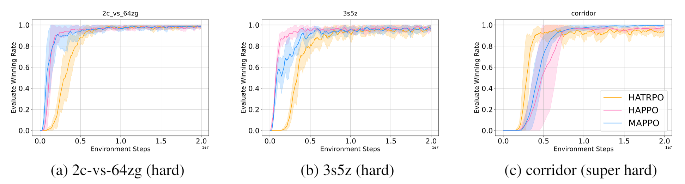
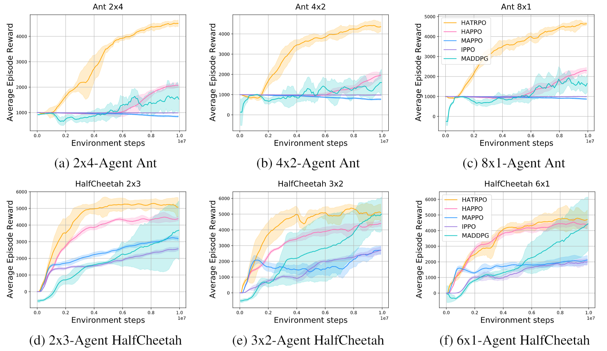
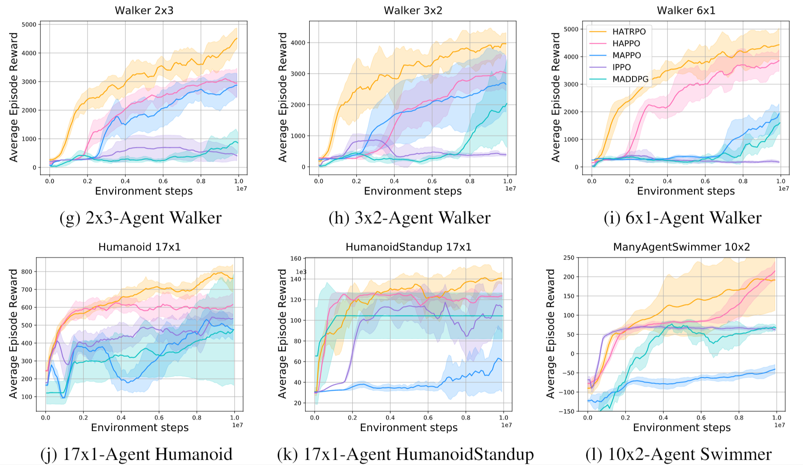

# Trust Region Policy Optimisation in Multi-Agent Reinforcement Learning
Described in the paper "[Trust Region Policy Optimisation in Multi-Agent Reinforcement Learning](https://arxiv.org/pdf/2109.11251.pdf)", this repository develops *Heterogeneous Agent Trust Region Policy Optimisation (HATRPO)* and *Heterogeneous-Agent Proximal Policy Optimisation (HAPPO)* algorithms on the bechmarks of SMAC and Multi-agent MUJOCO. *HATRPO* and *HAPPO* are the first trust region methods for multi-agent reinforcement learning **with theoretically-justified monotonic improvement guarantee**. Performance wise, it is the new state-of-the-art algorithm against its rivals such as [IPPO](https://arxiv.org/abs/2011.09533), [MAPPO](https://arxiv.org/abs/2103.01955) and [MADDPG](https://arxiv.org/abs/1706.02275)

## Installation
### Create environment
``` Bash
conda create -n env_name python=3.9
conda activate env_name
pip install -r requirements.txt
conda install pytorch torchvision torchaudio cudatoolkit=11.1 -c pytorch -c nvidia
```

### Multi-agent MuJoCo
Following the instructios in https://github.com/openai/mujoco-py and https://github.com/schroederdewitt/multiagent_mujoco to setup a mujoco environment. In the end, remember to set the following environment variables:
``` Bash
LD_LIBRARY_PATH=${HOME}/.mujoco/mujoco200/bin;
LD_PRELOAD=/usr/lib/x86_64-linux-gnu/libGLEW.so
```
### StarCraft II & SMAC
Run the script
``` Bash
bash install_sc2.sh
```
Or you could install them manually to other path you like, just follow here: https://github.com/oxwhirl/smac.

## How to run
When your environment is ready, you could run shell scripts provided. For example:
``` Bash
cd scripts
./train_mujoco.sh  # run with HAPPO/HATRPO on Multi-agent MuJoCo
./train_smac.sh  # run with HAPPO/HATRPO on StarCraft II
```

If you would like to change the configs of experiments, you could modify sh files or look for config files for more details. And you can change algorithm by modify **algo=happo** as **algo=hatrpo**.


## Some experiment results

### SMAC 




### Multi-agent MuJoCo on MAPPO

 

### 


